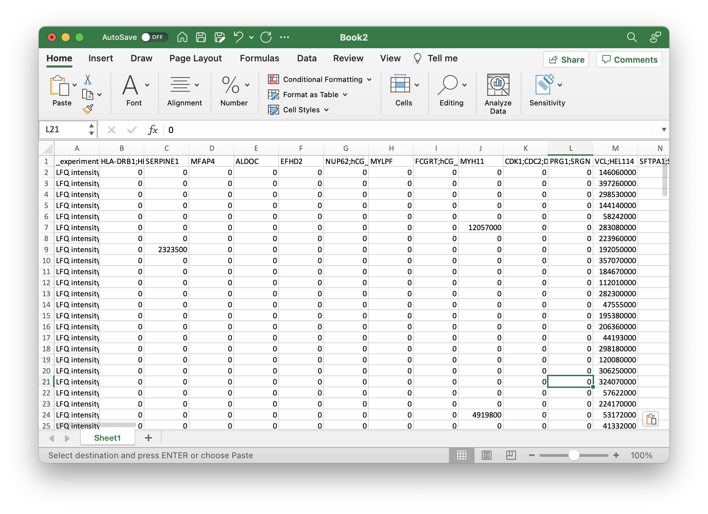
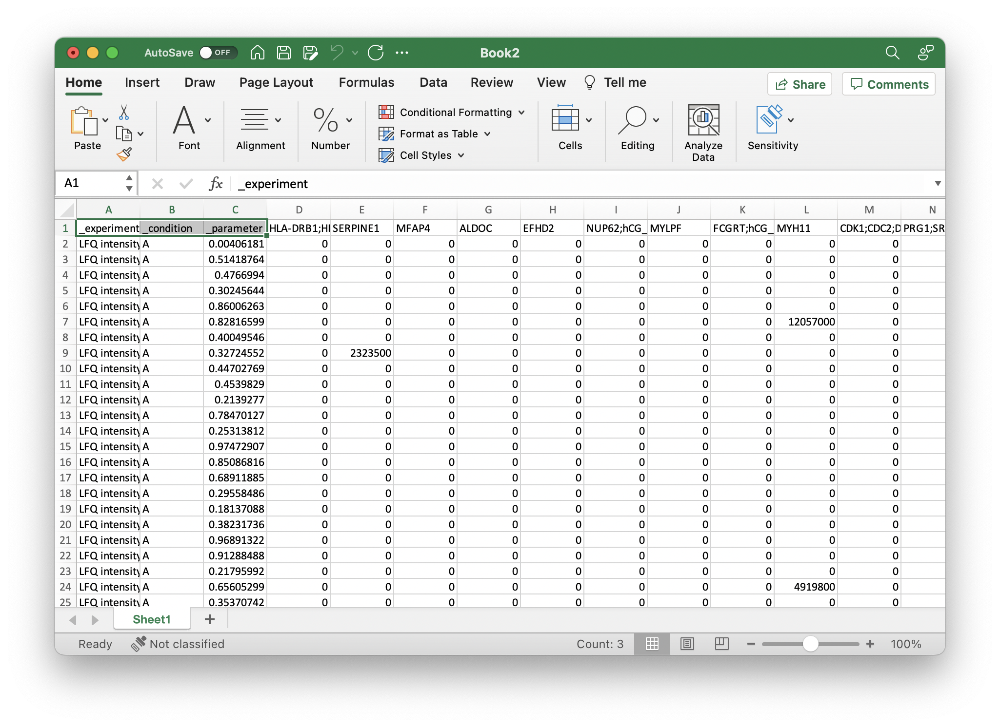
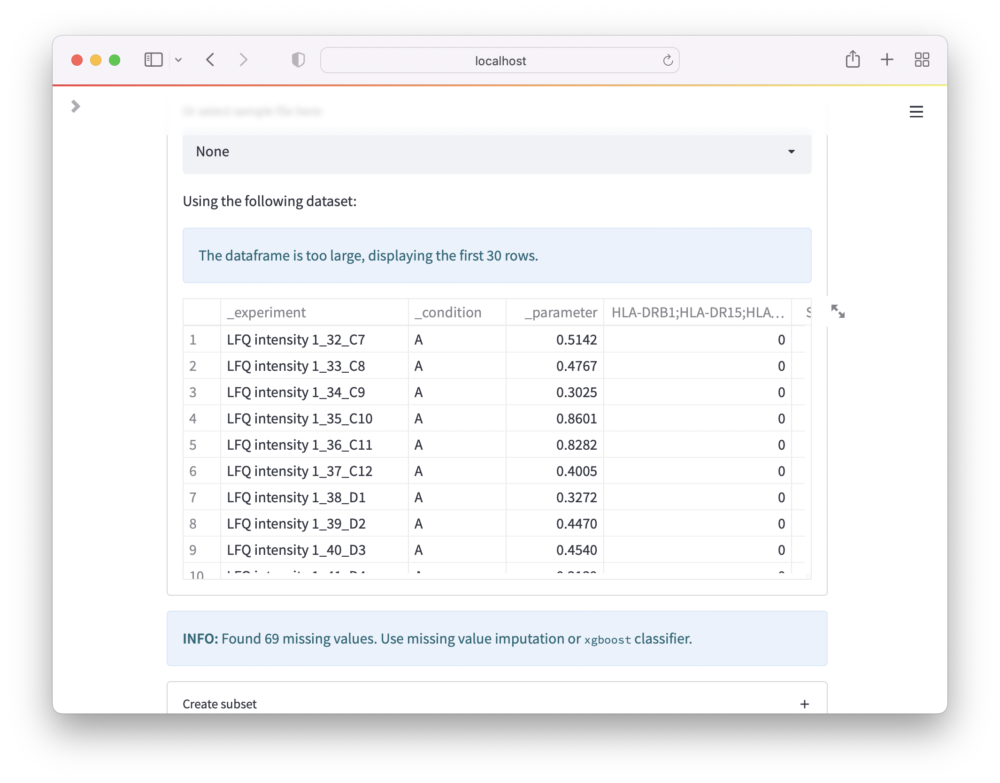
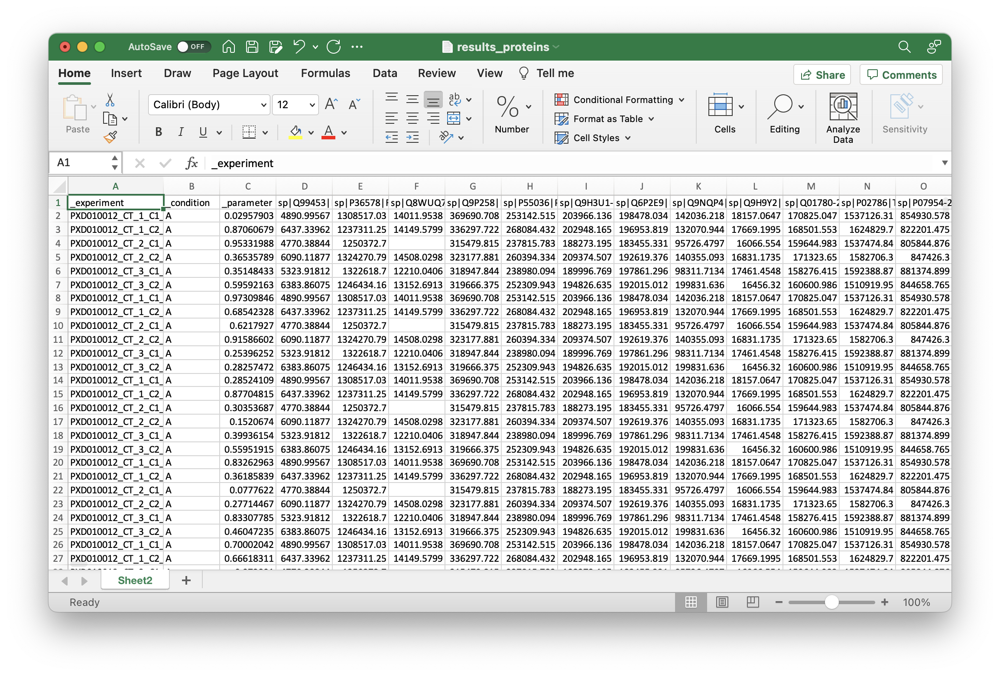
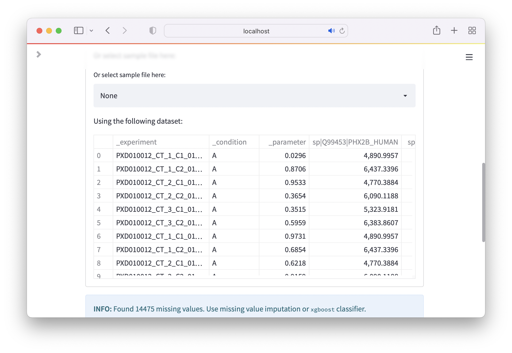
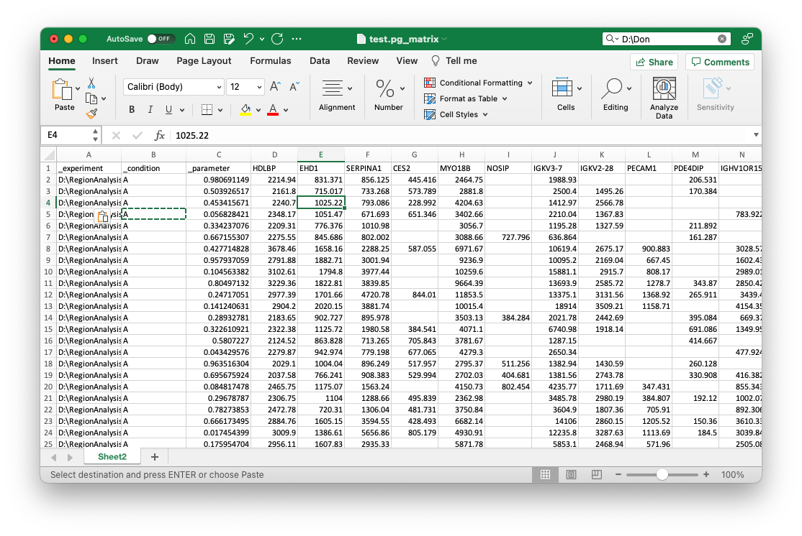
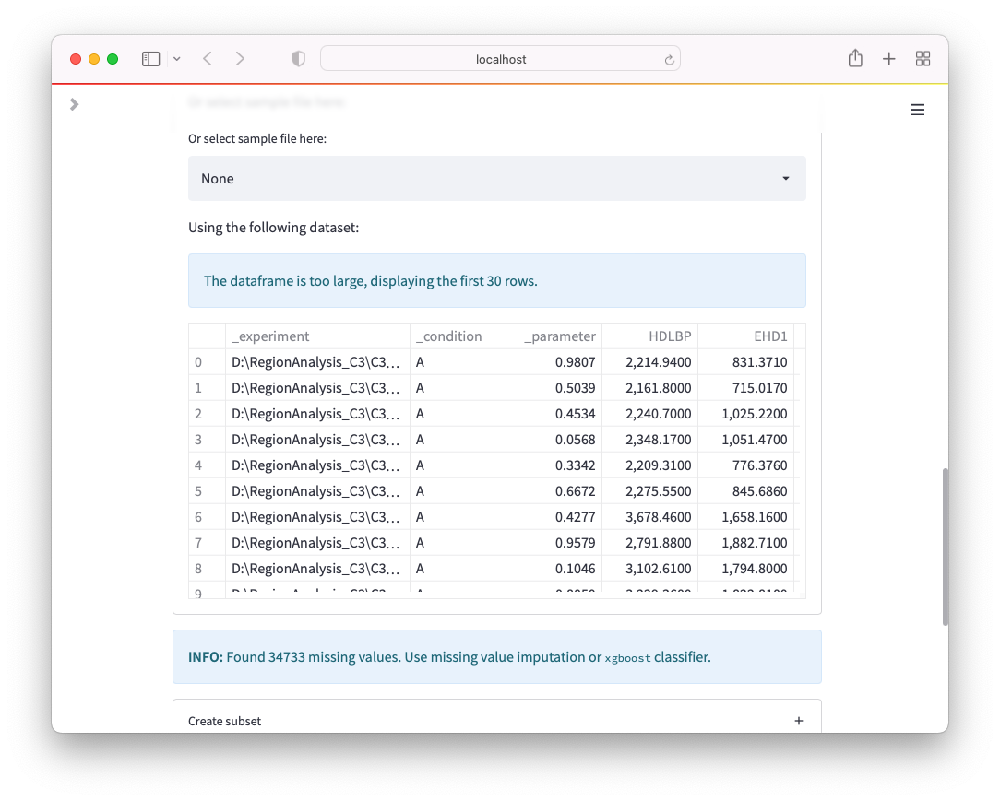

**OmicLearn** aims to alleviate access to the latest techniques in machine learning to be used for omics datasets. Here, the tool heavily relies on [scikit-learn](https://scikit-learn.org/stable/) and additionally integrates state-of-the-art algorithms such as xgboost.

A typical machine learning pipeline consists of `Preprocessing`, `Feature Selection`, `Classification` and `Validation` of your method.

With OmicLearn, you have the possibility to choose from several different choices and explore their effect when analyzing your data.

# 0. Data Preparation

OmicLearn can load data from various formats `.xlsx (Excel)`, `.csv (Comma-separated values)` or `.tsv (tab-separated values)`. In order for the columns to be recognized correctly, you will need to have a matrix where each row corresponds to an experiment and each column to a feature (i.e., a protein intensity or additional metadata).
`Identifiers` such as protein IDs, gene names, lipids, or miRNA IDs should be uppercase, and additional features should be marked with a leading underscore (`_`). Below are some instructions on how you would format a table from typical search engines. For this, we use Microsoft Excel, but any Spreadsheet manipulation tool should be possible (e.g., Numbers or OpenOffice).

## MaxQuant

Load `proteinGroups.txt`. Copy the column with the identifier you want to use, e.g. `Gene names` or `Majority protein IDs` and all Intensity fields with sample names (not the one that is only `Intensity`) to a new worksheet. If you have calculated the LFQ intensity, you would want to choose the LFQ intensity fields. Next, select all rows, copy them and paste them in another worksheet. Here, use `Paste Special` and select `Transpose`. If there should be errors using `Transpose` make sure that you have copied all rows and not the entire sheet.
You should have a table where each row corresponds to a sample and the columns for each measured intensity. Next, rename the identifier field to `_experiment` so that you know which row corresponds to which measured condition.

Your file should now look like this:

Next, you can add all additional metadata that you want to use for learning with an underscore `_`. This should be at least a field that you want to predict with machine learning. For the example, we added two columns, `_condition` and `_parameter` with respective values, like so:

Now, you can save the file as `*.xlsx` (Make sure there is only one sheet) and directly upload to OmicLearn, and the file should be correctly loaded:

Note: For MaxQuant, missing values can be represented as 0. If you want to try different methods for missinv flaue imputation, replace the 0 values with nothing.

## AlphaPept

Load `results_proteins.csv` in Excel. The first column is the protein identifier, and any other column is the quantified intensity. If you have used LFQ-quantification, you will have one intensity w/o LFQ and one with LFQ, which ends with `_LFQ`. Copy all of them in a new worksheet.
Next, select all rows, copy them and paste them into another worksheet. Here, use `Paste Special` and select `Transpose`. If there should be errors using `Transpose` make sure that you have copied all rows and not the entire sheet.
You should have a table where each row corresponds to a sample and the columns for each measured intensity. Next, rename the identifier field to `_experiment` so that you know which row corresponds to which measured condition.

Your file should now look like this:

Next, you can add all additional metadata that you want to use for learning with an underscore `_`. This should be at least a field that you want to predict with machine learning. For the example, we added two columns `_condition` and `_parameter` with respective values, like so:

Now, you can save the file as `*.xlsx` (Make sure there is only one sheet) and directly upload to OmicLearn, and the file should be correctly loaded:

## DIA-NN

Load the file ending with `pg_matrix.tsv` in Excel. Copy the column with the identifier you want to use, e.g. `Genes` or `Protein.Group` and all Intensity fields with sample names to a new worksheet. Next, select all rows, copy them and paste them in another worksheet. Here, use `Paste Special` and select `Transpose`. If there should be errors using `Transpose` make sure that you have copied all rows and not the entire sheet.
You should have a table where each row corresponds to a sample and the columns for each measured intensity. Next, rename the first column, which carries the identifier to `_experiment` so that you know which row corresponds to which measured condition.

Your file should now look like this:

Next, you can add all additional metadata that you want to use for learning with an underscore `_`. This should be at least a field that you want to predict with machine learning. For the example, we added two columns `_condition` and `_parameter` with respective values, like so:

Now, you can save the file as `*.xlsx` (Make sure there is only one sheet) and directly upload to OmicLearn, and the file should be correctly loaded:

## Troubleshooting

### Transpose
If you experience errors when using Transpose in Excel, such as `You can't paste this here because the Copy area and paste area aren't the same size.`,
make sure that you do not copy the entire worksheet but select all rows instead.

### Formatting issues
Several issues can arise when formatting, e.g. when using `Genes`. As an example, Excel sometimes confuses Gene names with Dates and Genes like `SEPHS1` could end up being detected as Dates. Within OmicLearn, you might see the following warning when loading the file:

# 1. Preprocessing

A critical step in machine learning (ML) is data preprocessing. It is used to convert data that can have very different data ranges and exhibit outliers to be more uniform to be used with ML algorithms. Here, we can distinguish three separate aspects that are of particular interest when dealing with proteomics data:

* Standardization
* Imputation of missing values
* Data encoding

This part is primarily based on the [Scikit-learn documentation about preprocessing](https://scikit-learn.org/stable/modules/preprocessing.html), where additional information can be found.

## 1. 1. Standardization

A common requirement for machine learning estimators is that datasets are standardized. The rationale behind this requirement can be easily understood when considering an iterative optimization method, such as the `gradient descent`. Here, the probability of finding a global optimum within a certain number of iterations strongly depends on the step size in each iteration (learning rate). Arguably, when having values outside of a normal range, optimization with a default learning rate is less likely to succeed.

As different classifiers use different optimizers, they are more or less suspective to proper standardization. Scalers for linear transformation and non-linear transformation such as [QuantileTransformer](#1-1-5-quantiletransformer) and  [PowerTransformer](#1-1-4-powertransformer) can be distinguished.

Within OmicLearn, the following options can be selected:

### [1. 1. 1. StandardScaler](https://scikit-learn.org/stable/modules/generated/sklearn.preprocessing.StandardScaler.html)

The option [`StandardScaler`](https://scikit-learn.org/stable/modules/generated/sklearn.preprocessing.StandardScaler.html) standardizes features by removing the mean and scaling it to unit variance. This is also known as z-Normalization and is widely used in Proteomics.
The transformation is done according to the following formula:

> z = (x - u) / s
>
> In this formula, while `x` refers to a sample, `u` refers to mean and `s` refers to the standard deviation of the data.

Note that the StandardScaler is very susceptible to outliers as they have a significant influence when calculating the mean and standard deviation.

### [1. 1. 2. MinMaxScaler](https://scikit-learn.org/stable/modules/generated/sklearn.preprocessing.MinMaxScaler.html)
Another option to scale data is to transform it according to their minimum and maximum values. Here, data is rescaled so that the minimum corresponds to 0 and the maximum to 1 according to the following formula:

> X_std = (X - X.min(axis=0)) / (X.max(axis=0) - X.min(axis=0))

> X_scaled = X_std * (max - min) + min

Note that, similar to the MinMaxScaler StandardScaler is very susceptible to outliers as they would define the minimum / maximum.

### [1. 1. 3. RobustScaler](https://scikit-learn.org/stable/modules/generated/sklearn.preprocessing.RobustScaler.html)
To achieve a more robust scaling, we can employ the `RobustScaler`. Here, the data is scaled on percentiles and hence not easily influenced by some outliers. More precisely, the median and the `IQR (Interquartile Range) = Q3 (75th Quantile) - Q1 (25th Quantile) ` are used.

### [1. 1. 4. PowerTransformer](https://scikit-learn.org/stable/modules/generated/sklearn.preprocessing.PowerTransformer.html)

`PowerTransformer`, can apply a power transformation for each feature in the dataset to make it more Gaussian-like and is useful when dealing with skewed datasets. Here, two options are available: `Yeo-Johnson`, which can work with negative data, and `Box-Cox`, that is limited to positive data.

### [1. 1. 5. QuantileTransformer](https://scikit-learn.org/stable/modules/generated/sklearn.preprocessing.QuantileTransformer.html)
`QuantileTransformer` provided by `scikit-learn` uses quantile information to transform features to follow a gaussian distribution (Option `Gaussian output` or a uniform output (Option 'Uniform output`).

### 1. 1. 6. Additional Notes

> Notes: Scikit-learn also provides additional scalers such as the `Normalizer`. We decided not to include this for the analysis of proteomic datasets for now.

An overview of how different scaling methods change the dataset can be found [here](https://scikit-learn.org/stable/auto_examples/preprocessing/plot_all_scaling.html):

---

## 1. 2. Imputation of missing values

Proteomic measurements often face the problem that the dataset will have missing values. This is especially the case for DDA acquisition when a precursor is not picked for fragmentation. To use a proteomic dataset with a machine learning optimizer, it is required to develop a strategy to replace the missing values (impute). Here a key challenge is on how the data should be imputed. For regular ML tasks, rows with missing values are often simply deleted; however when applying this to a proteomic dataset, a lot of data would be discarded as the number of missing values is significant. Especially in a clinical context, the imputation of values can be critical as ultimately, this will be the foundation on whether a disease state will be classified or not. Consider the case where an imbalanced dataset exists, and a z-normalization is performed: The mean protein intensity would be zero, this would correspond to the larger class, and when imputing with zeros, one would bias the classification only due to the imputation.

Only some algorithms, such as `xgboost` have implemented methods that can handle missing values and do not need missing value imputation.

This part is primarily based on the [Scikit-learn documentation about imputation](https://scikit-learn.org/stable/modules/impute.html), where additional information can be found.
### 1. 2. 1. Zero
In this option, the missing values are filled with `0`.

### 1. 2. 2. Mean
Using `Mean` for imputation, missing protein values are replaced with the `mean` of the same protein.

### 1. 2. 3. Median
Using `Median` for imputation, missing protein values are replaced with the `median` of the same protein.

### 1. 2. 4. [KNNImputer](https://scikit-learn.org/stable/modules/generated/sklearn.impute.KNNImputer.html#sklearn.impute.KNNImputer)
The `KNNImputer` is trying to estimate missing values from existing values. Here, this is done by using a `k-Nearest Neighbors` approach. In brief, a Euclidean distance metric is used to find out the nearest neighbors, and the missing value is estimated by taking the mean of the neighbors.

### 1. 2. 5. None
When selecting None, no missing value imputation is performed. If the dataset exists, only some classifiers that can handle missing values, such as `xgboost` will be selectable.

---
## 1. 3. Data encoding
Another step in ML is that data needs to be encoded. When having categorical data, they need to be transformed. For proteomics data, this is typically unnecessary as we already have the protein intensity, which is a discrete variable. Within OmicLearn, we also allow to use additional features that could be categorical. Whenever a column contains non-numerical values, we use the [label encoder](https://scikit-learn.org/stable/modules/generated/sklearn.preprocessing.LabelEncoder.html) from scikit-learn, which transforms categorical values numerical values (i.e., `male`|`female` will be `0`|`1`).

# 2. Feature selection

Feature selection is a crucial part when building a machine learning pipeline. This refers to making only a subset of data available for the machine learning classifier, i.e., only taking ten proteins. For training, we would like to select only features that contribute to our prediction so that the classifier does not try to learn from unrelated features and ultimately will generalize well. This is especially important for a clinical proteomics setup as we can choose for a large number of features (protein signals) while often having only small sample numbers. Reducing the number of proteins will also help us identify core players contributing to a classification model. Within OmicLearn, several algorithms are implemented that allow reducing the number of features.

> **Note:** Proteomics features can be highly correlated (Multicollinear). This leads to the problem that features importance can be somewhat ambiguous, i.e., removing a protein with high feature importance does not necessarily decrease the overall accuracy if the machine learning classifier can extract the information from linearly correlated protein signals.

## [2. 1. ExtraTrees](https://scikit-learn.org/stable/modules/generated/sklearn.ensemble.ExtraTreesClassifier.html)

One way to reduce the number of features is by using a randomized decision trees (a.k.a. extra-trees) approach, where a classifier is trained to distinguish the classes, and the features with the highest importance are selected.  

---

Another way for feature selection is by using the `SelectKBest` strategy. Here, features are selected based on the `k` highest scores. Here, we have the following options available: `chi2`, `f_classif`, `mutual_info_classif`.

## [2. 2. k-best (chi2)](https://scikit-learn.org/stable/modules/generated/sklearn.feature_selection.chi2.html)
Here, the chi-squared stats between features and the class is used as the k-score.

## [2. 3. k-best (mutual_info_classif)](https://scikit-learn.org/stable/modules/generated/sklearn.feature_selection.f_classif.html#sklearn.feature_selection.mutual_info_classif)

Here, an estimate for the mutual information of variables is used as the k-score.

## [2. 4. k-best (f_classif)](https://scikit-learn.org/stable/modules/generated/sklearn.feature_selection.f_classif.html#sklearn.feature_selection.f_classif)

Here,  an estimate for the ANOVA (ANalysis Of VAriance) F-value is used as the k-score.

# 3. Exploratory data analysis (EDA)

Exploratory Data Analysis (EDA) is an important approach to get more insight into the dataset before building a model. It aids in pattern discovery and anomaly detection and allows verifying assumptions via graphical representations.

## 3. 1. Hierarchical clustering

Hierarchical clustering (also known as hierarchical cluster analysis) enables researchers to group similar features hierarchically and it displays the hierarchical relationships between the features with dendrograms. This allows users to visualize different sub-clusters, sets of features that strongly correlate and provide an overview of the dataset. We provide an interactive heatmap so that feature names can quickly be retrieved by hovering over the data point. This allows verifying whether a correlation might be expected or is random.

## [3. 2. Principal component analysis](https://scikit-learn.org/stable/modules/generated/sklearn.decomposition.PCA.html)

Principal component analysis (PCA) is widely used for reducing the dimensionality of the data to make large datasets more interpretable. When creating a graphical representation of data, one is typically limited to 2D or 3D representations, which poses a practical problem when wanting to visualize datasets with much more features. With the help of PCA, it is possible to reduce the number of features while trying to conserve the information content. We employ PCA to reduce dimensionality to display the data in a 2D graph.

One use case of PCA is to identify major sources of variations in a dataset as PCA will cluster similar data points together. Hence, by inspecting datapoints that cluster together, you can assess whether variations can be attributed to your experimental setup, special biological conditions, experimental or sample bias. A common example for this is difference in sample preparation, e.g., by a different laboratory assistant or institute.

# 4. Classification

Classification refers to the task of correctly classifying the label of given data points. In the context of clinical proteomics, this refers to predicting a disease state based on protein signals. The core task of a classifier is to define a decision boundary in an n-dimensional space. Depending on the underlying mechanism of the classifier, different decision boundaries can be achieved. An excellent overview of the performance of different classifiers and their decision boundary can be found [here](https://scikit-learn.org/stable/auto_examples/classification/plot_classifier_comparison.html).

Within OmicLearn, you can choose from a wide range of classifiers. Understanding why a classifier performs better or worse on a dataset requires in-depth knowledge of the underlying mechanisms and careful tuning of their hyperparameters. Also, OmicLearn allows you to try different optimizers. Follow the links below to learn more about each option:

## [4. 1. AdaBoost](https://scikit-learn.org/stable/modules/ensemble.html#adaboost)

## [4. 2. LogisticRegression](https://scikit-learn.org/stable/modules/generated/sklearn.linear_model.LogisticRegression.html)

## [4. 3. RandomForest](https://scikit-learn.org/stable/modules/generated/sklearn.ensemble.RandomForestClassifier.html)

## [4. 4. XGBoost](https://xgboost.readthedocs.io/en/latest/)

## [4. 5. DecisionTree](https://scikit-learn.org/stable/modules/tree.html)

## [4. 6. KNeighborsClassifier](https://scikit-learn.org/stable/modules/generated/sklearn.neighbors.KNeighborsClassifier.html)

## [4. 7. LinearSVC](https://scikit-learn.org/stable/modules/generated/sklearn.svm.LinearSVC.html)

# 5. Validation

## [5. 1. Cross Validation](https://scikit-learn.org/stable/modules/cross_validation.html)

In order to evaluate the performance of a Machine Learning (ML) model, we can employ several methods. One commonly used method that can be universally applied is to train on a subset of the data and predict and evaluate on the remainder. This is used to investigate the performance of the model on previously unseen data. Generally speaking, one wants the model to generalize well, referring to the idea that a machine learning model should be able to capture the trend of the data. If this is not possible because the model is too simple, we refer to this as `underfitting`. Contrary to that, a model that is too complex could `overfit` and starts to capture sample-specific noise and thus will not be able to maintain accuracy when using another dataset.

For a typical approach, one would split all available data into train, validation, and test (holdout) set. Here, the train and validation sets are used to optimize a Machine Learning method, and the test set is used for a final test on unseen data. As OmicLearn is intended to be an exploratory tool to assess the performance of algorithms when applying to specific data rather than having a classification model for production, no holdout set is used and the performance metrics have to be interpreted accordingly. This is also so that repeated analysis of the same dataset and choosing the same holdout set could lead to an unconscious selection bias and false confidence assessment.

One way to get an estimate on how a model would generalize while still trying to use all available data is Cross-Validation (CV). Here, data is repeatedly split into train and validation sets. Note that the missing value imputation and feature selection will be applied to each split of the dataset during the cross-vacation phase and not on all data in the beginning. This is to avoid potential information leakage and overfitting the dataset.

OmicLearn is using a stratified-k-fold split, meaning that the original class ratio will be preserved for the splits.
Also, it is possible to shuffle the data and repeatedly shuffle the data and splitting it. The average of multiple splits gives a more robust estimate of the model performance.  The number of splits and the number of repeats can be changed with `cv_splits` and `cv_repeats`.

Also, within OmicLearn, [StratifiedKFold](https://scikit-learn.org/stable/modules/generated/sklearn.model_selection.StratifiedKFold.html) and [StratifiedShuffleSplit](https://scikit-learn.org/stable/modules/generated/sklearn.model_selection.StratifiedShuffleSplit.html) methods might be used in addition to [RepeatedStratifiedKFold](https://scikit-learn.org/stable/modules/generated/sklearn.model_selection.RepeatedStratifiedKFold.html).

## [5. 2. Scores](https://scikit-learn.org/stable/modules/model_evaluation.html)
In ML, there are several metrics to be employed for measuring the performance of the model, and for evaluating the quality of predictions.

### [5. 2. 1. ROC AUC Score](https://scikit-learn.org/stable/modules/generated/sklearn.metrics.roc_auc_score.html#sklearn.metrics.roc_auc_score)
This score reflects the computation of Area Under the Curve (`AUC`) of Receiver Operating Characteristics (`ROC`). It is also known as Area Under the Receiver Operating Characteristics (AUROC).

A good brief introduction for understanding the `ROC` can be found [here](https://www.datasciencecentral.com/profiles/blogs/roc-curve-explained-in-one-picture).

### [5. 2. 2. PR AUC Score](https://scikit-learn.org/stable/modules/generated/sklearn.metrics.precision_recall_curve.html)
This `Precision-Recall Curve` (or `PR Curve`) is a plot of the `precision` on the y-axis and the `recall` on the x-axis at different thresholds.

Also, the `PR AUC Score` is the calculation of Area Under the Curve (`AUC`) of `Precision-Recall Curve` (`PR Curve`).

> For imbalanced datasets, `PR Curve` might be a better choice.

A detailed explanation for `PR Curve` can be found [here](https://acutecaretesting.org/en/articles/precision-recall-curves-what-are-they-and-how-are-they-used).

### [5. 2. 3. Precision Score](https://scikit-learn.org/stable/modules/generated/sklearn.metrics.precision_score.html#sklearn.metrics.precision_score)

Precision refers to a ratio of correctly classified positive samples to the total classified positive samples.

### [5. 2. 5. Recall Score](https://scikit-learn.org/stable/modules/generated/sklearn.metrics.recall_score.html#sklearn.metrics.recall_score)
`Recall` score is also known as `Sensitivity`.  This metric computes the fraction of true positive results out of all positively predicted results.

### [5. 2. 5. F1 Score](https://scikit-learn.org/stable/modules/generated/sklearn.metrics.f1_score.html#sklearn.metrics.f1_score)
`F1 Score` is the weighted average of both `Precision` and `Recall`.

### [5. 2. 6. Balanced Accuracy Score](https://scikit-learn.org/stable/modules/generated/sklearn.metrics.balanced_accuracy_score.html#sklearn.metrics.balanced_accuracy_score)
The balanced accuracy calculates the average `Recall` for each class.

### 5. 2. 7. Confusion Matrix
`Confusion matrix` is a table with 4 different combinations of predicted and actual values.
