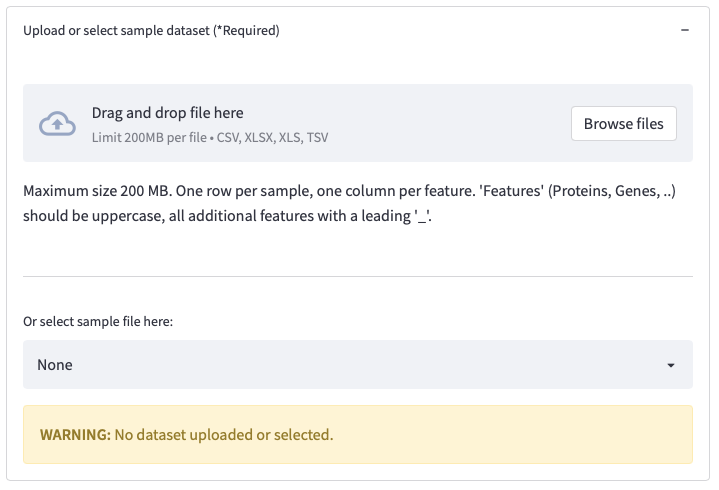
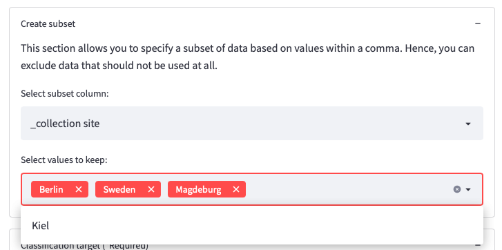
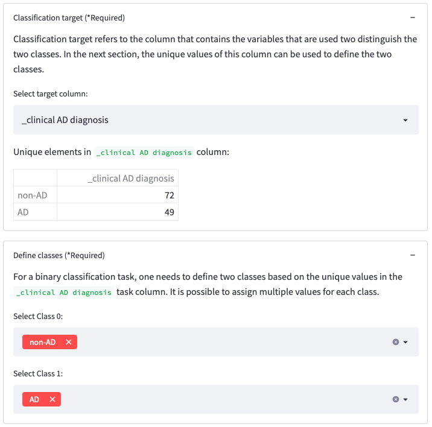
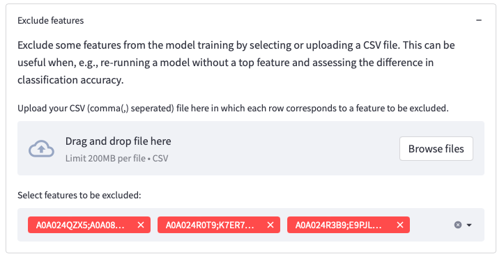
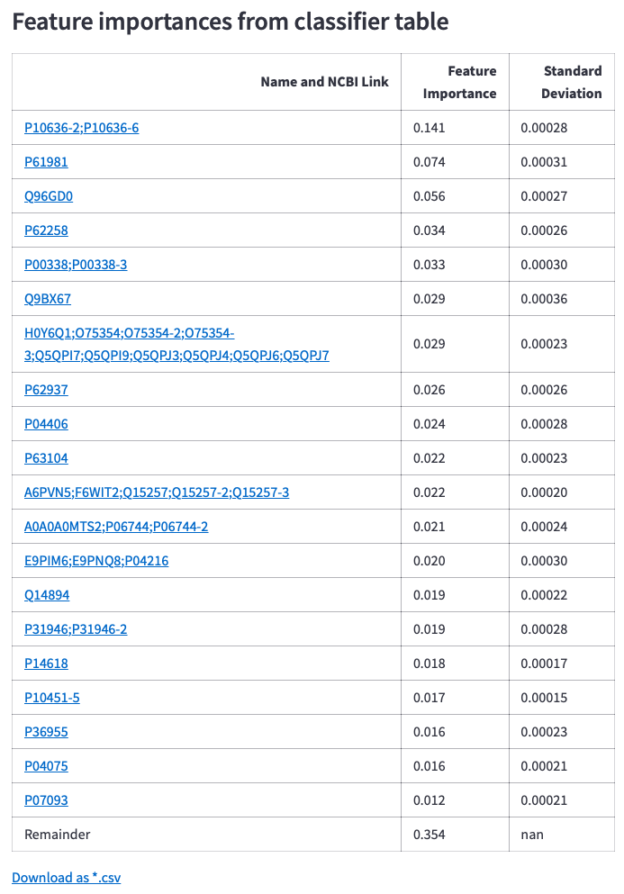
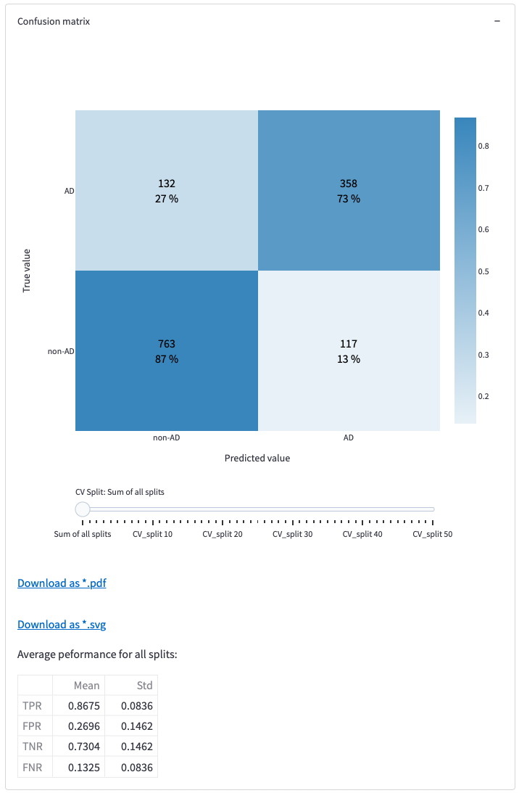
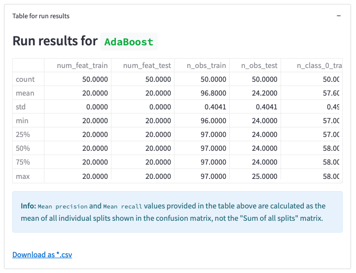
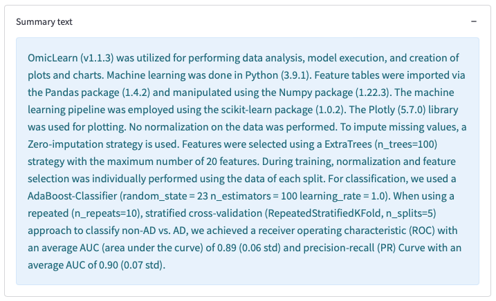

## Using OmicLearn
**OmicLearn** enables researchers and scientists to explore the latest algorithms in machine learning (ML) for their usage in proteomics/transcriptomics.

The core steps of the pipeline are  `Preprocessing`, `Missing Value Imputation`, `Feature Selection`, `Classification`, and `Validation` of selected method/algorithms and are presented in the flowchart below:

_**Figure 1:** Main steps for the workflow of OmicLearn at a glance_

## Uploading data

Own data can be uploaded via dragging and dropping on the file menu or clicking the link.
The data should be formatted according to the following conventions:

> - The file format should be `.xlsx (Excel)`, `.csv (Comma-separated values)` or `.tsv (tab-separated values)`.  For `.csv`, the separator should be either `comma (,)` or `semicolon (;)`.
>
> - Maximum file size is 200 Mb.
>
> - 'Identifiers' such as protein IDs, gene names, lipids or miRNA IDs should be uppercase.
>
> - Each row corresponds to a sample, each column to a feature.
>
> - Additional features should be marked with a leading underscore (`_`).

_**Figure 2:** Uploading a dataset or selecting a sample file_

The data will be checked for consistency, and if your dataset contains missing values (`NaNs`), a notification will appear.
Then, you might consider using the methods listed on the left sidebar for the imputation of missing values.

_**Figure 3:** Missing value warning_

### Sample Datasets

OmicLearn has several sample [datasets](https://github.com/MannLabs/OmicLearn/tree/master/data) included that can be used for exploring the analysis, which can be selected from the dropdown menu.

Here is the list of sample datasets available:

**`1. Alzheimer Dataset`**
> 📁 **File Name:** Alzheimer.xlsx
>
> 📖 **Description:** Proteome profiling in cerebrospinal fluid reveals novel biomarkers of Alzheimer's disease
>
> 🔗 **Source:** Bader, J., Geyer, P., Müller, J., Strauss, M., Koch, M., & Leypoldt, F. et al. (2020). Proteome profiling in cerebrospinal fluid reveals novel biomarkers of Alzheimer's disease. Molecular Systems Biology, 16(6). doi: [10.15252/msb.20199356](http://doi.org/10.15252/msb.20199356).

**`2. Sample Dataset`**
> 📁 **File Name:** Sample.xlsx
>
> 📖 **Description:** Sample dataset for testing the tool
>
> 🔗 **Source:** -

## Sidebar: Selecting Parameters

OmicLearn has a large variety of options to choose from which are detailed in the [methods wiki](https://github.com/MannLabs/OmicLearn/wiki/METHODS).  The parameters can be selected in the sidebar.

Moreover, after changing the parameters, you are asked to re-run the analysis. Each analysis result will be stored in the [`Session History` section](#checking-the-session-history).

_**Figure 4:** OmicLearn sidebar options_

## Main Window: Selecting data, define workflow, and explore results

### Data Selection

After uploading the data, the data will be displayed within the OmicLearn window and can be explored. The dropdown menu `Subset` allows you to specify a subset of data based on values within a column. This way, you can exclude data that should not be used at all. An example use case could be that you collected data from different sites and want to exclude a site.

_**Figure 5:** Example usage for `Subset` section_

Within `Features`, you should select the target column. This refers to the variable that the classifier should be able to distinguish. As we are performing a binary classification task, there are only two options for the outcome of the classifier. By assigning multiple values to a class, multiple combinations of classifications can be tested.

_**Figure 6:** `Classification target` section for selecting the target columns and `Define classes` section for assigning the classes_

Furthermore, `Additional Features` can be selected. This refers to columns that are not your identifiers such as protein IDs, gene names, lipids or miRNA IDs (not uppercase and have a leading underscore (`_`).

_**Figure 7:** Sample case for `Additional Features` option_

The section `Exclude identifiers` enables users to exclude selected features manually. This can be useful e.g., when wanting to asses performance without a top feature. There is also an option to upload a file with multiple features that should be excluded.

> To utilize this option, you should upload a CSV (comma `,` separated) file where each row corresponds to a feature to be excluded. Also, the file should include a header (title row).

_**Figure 8:** Selections on the dataset_

The option `Cohort comparison` allows comparing results over different cohorts (i.e., train on one cohort and predict on another)

_**Figure 9:** Selections on the dataset_

### Running the Workflow
After selecting all parameters you are able to execute the workflow by clicking the `Run Analysis` button.

### Analysis results and plots
Once the analysis is completed, OmicLearn automatically generates the plots together with a table showing the results of each validation run. The plots are downloadable as `.pdf` and `.svg` format in addition to the `.png` format provided by Plotly.

_**Figure 10:** Bar chart for feature importance values received from the classifier after all cross-validation runs, its table containing links to NCBI search and download options_

_**Figure 11:** Receiver operating characteristic (ROC) Curve, Precision-Recall (PR) Curve and download options_

_**Figure 12:** Confusion matrix, slider for looking at the other matrix tables and download options_

OmicLearn generates a `Summary` to describe the method. This can be used for a method section in a publication.

_**Figure 13:** Results table of the analysis, its download option, and auto-generated `Summary` text_

### Checking the Session History

Each analysis run will be appended to the `Session History` so that you can investigate the different results for different parameter sets.

_**Figure 14:** Session history table and download option_
